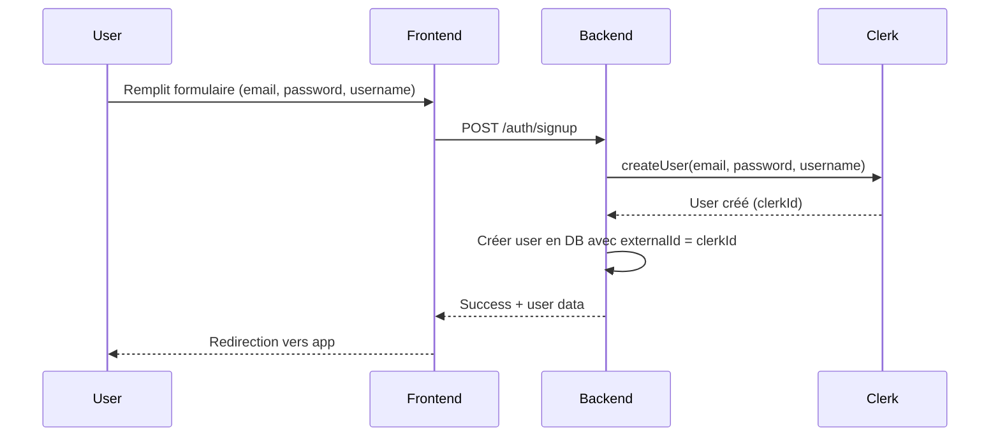
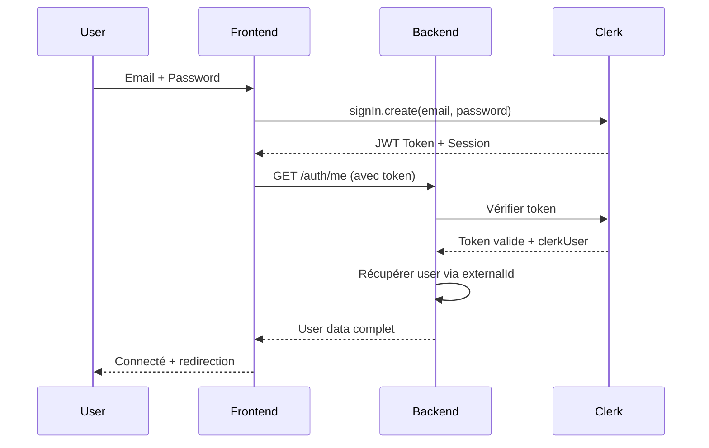
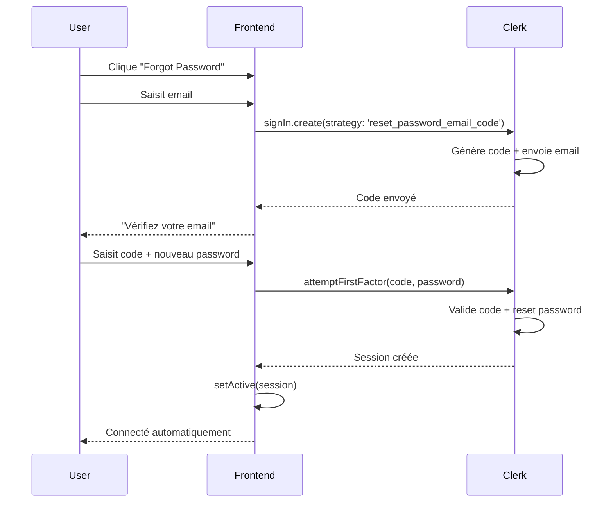

# Architecture d'Authentification - GearConnect

## Vue d'ensemble

GearConnect utilise une architecture hybride qui sépare clairement les responsabilités entre :
- **Clerk** : Gestion complète de l'authentification
- **Backend** : Gestion des données métier 
- **Frontend** : Interface utilisateur et orchestration

```
┌─────────────────┐    ┌─────────────────┐    ┌─────────────────┐
│                 │    │                 │    │                 │
│   FRONTEND      │    │    BACKEND      │    │     CLERK       │
│  (React Native) │    │   (Express)     │    │   (Auth Service)│
│                 │    │                 │    │                 │
├─────────────────┤    ├─────────────────┤    ├─────────────────┤
│ • Auth UI       │◄──►│ • Users data    │    │ • Passwords     │
│ • Session mgmt  │    │ • Posts         │◄──►│ • Email sending │
│ • Token storage │    │ • Events        │    │ • 2FA           │
│ • Clerk SDK     │    │ • Performances  │    │ • JWT tokens    │
│                 │    │ • Token verify  │    │ • Security      │
└─────────────────┘    └─────────────────┘    └─────────────────┘
```

## Flux d'Authentification

### 1. Inscription (Sign Up)



### 2. Connexion (Sign In)



### 3. Forgot Password (SANS Backend)



## Structure des Données

### Clerk (Cloud)
```typescript
interface ClerkUser {
  id: string;                    // "user_2xJ8..."
  emailAddresses: EmailAddress[];
  passwordDigest: string;        // Géré par Clerk
  firstName?: string;
  lastName?: string;
  imageUrl?: string;
  // + Autres champs Clerk
}
```

### Backend Database (MySQL)
```sql
CREATE TABLE users (
  id INT PRIMARY KEY AUTO_INCREMENT,
  externalId VARCHAR(255) UNIQUE,  -- Lien vers Clerk
  email VARCHAR(255) UNIQUE,
  username VARCHAR(255) UNIQUE,
  name VARCHAR(255),
  birthday DATETIME,
  isVerify BOOLEAN DEFAULT FALSE,
  additionnalData JSON,
  createdAt DATETIME DEFAULT CURRENT_TIMESTAMP
  -- PAS de password ici !
);
```

### Frontend Context
```typescript
interface User {
  id: string | number;           // ID from backend
  clerkId?: string;              // ID from Clerk
  email: string;
  username?: string;
  photoURL?: string;
}
```

## Avantages de cette Architecture

### 🔐 Sécurité
- **Mots de passe jamais stockés** dans notre backend
- **Chiffrement** géré par Clerk (experts en sécurité)
- **Conformité** GDPR, SOC 2, etc. assurée par Clerk
- **Attaques** réduites (pas de DB de passwords à protéger)

### 🚀 Performance  
- **Moins de charge** sur notre backend
- **CDN global** Clerk pour l'authentification
- **Cache** optimisé pour les tokens
- **Scalabilité** automatique

### 🛠 Maintenance
- **Pas de gestion** des emails de reset
- **Pas de cryptage/décryptage** des passwords
- **Pas de gestion** de l'expiration des codes
- **Focus** sur la logique métier

### 💼 Fonctionnalités
- **2FA** inclus gratuitement
- **SSO** possible (Google, Apple, etc.)
- **Webhooks** pour synchronisation
- **Analytics** d'authentification

## Cas d'Usage Spécifiques

### Forgot Password
❌ **Approche traditionnelle (non utilisée):**
```typescript
// Backend aurait besoin de:
app.post('/auth/forgot-password', async (req, res) => {
  // 1. Vérifier email existe
  // 2. Générer token temporaire
  // 3. Stocker token en DB avec expiration
  // 4. Envoyer email avec lien
  // 5. Gérer expiration, sécurité, etc.
});

app.post('/auth/reset-password', async (req, res) => {
  // 1. Vérifier token valide et non expiré
  // 2. Hasher nouveau password
  // 3. Mettre à jour en DB
  // 4. Invalider token
});
```

✅ **Approche actuelle (avec Clerk):**
```typescript
// Frontend seulement:
await signIn.create({
  strategy: 'reset_password_email_code',
  identifier: email,
});

await signIn.attemptFirstFactor({
  strategy: 'reset_password_email_code',
  code,
  password,
});
```

### Avantages évidents :
- **10x moins de code** à maintenir
- **0 vulnérabilité** de sécurité côté backend
- **Email design** professionnel automatique
- **Localisation** automatique
- **Analytics** inclus

## Configuration Requise

### Clerk Dashboard
1. ✅ Email authentication activée
2. ✅ Password reset activé
3. ✅ Email provider configuré
4. ✅ Templates customisés (optionnel)

### Backend Environment
```env
CLERK_SECRET_KEY=sk_test_xxx
CLERK_PUBLISHABLE_KEY=pk_test_xxx
```

### Frontend Environment  
```typescript
const CLERK_PUBLISHABLE_KEY = "pk_test_xxx";
```

## Troubleshooting

### ❓ "Pourquoi pas d'endpoint backend pour forgot password ?"
**Réponse :** Clerk gère déjà tout cela de manière plus sécurisée et robuste que ce qu'on pourrait développer.

### ❓ "Et si Clerk tombe en panne ?"
**Réponse :** 
- Clerk a 99.9% uptime SLA
- Fallback possible avec les sessions existantes
- Monitoring et alertes disponibles

### ❓ "Comment synchroniser les données ?"
**Réponse :**
- Webhooks Clerk → Backend pour maj automatiques
- Middleware backend vérifie tokens via Clerk SDK
- Sync automatique à la connexion

## Ressources

- [Documentation Clerk](https://clerk.com/docs)
- [Best Practices Clerk](https://clerk.com/docs/security/overview)
- [Architecture Examples](https://github.com/clerkinc/clerk-nextjs-examples) 